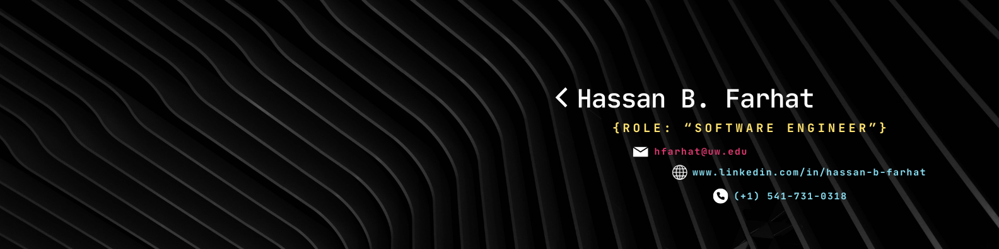

  
  

<h2 align=center> Hello, I see you've stumbled on my page! I'm Hassan Farhat </h2>
  
 
    I'm a current graduating senior at the University of Washington Tacoma, majoring in B.S. Computer Science and Systems.
     
     
    I've engaged in many collaborative projects which has helped me work on my skills in teamwork, communication, and problem-solving.
     
     
    Having gained tons of theoretical knowledge and practical expertise from my studies, I am interested in working as a SWE, on projects such as Frontend, Backend, Fullstack... really anything that is enjoyable and may have an impact on others.
  

 

<h2 align=center> Languages, Tools, Technologies </h2>
  

    
    
    
    
    
    
    
    
    
    
    
    
    
    
    
    
    
    
  

 

<h2 align=center> Want to Connect? Contact Me </h2>
  

    
    
    
  

 

  
  

